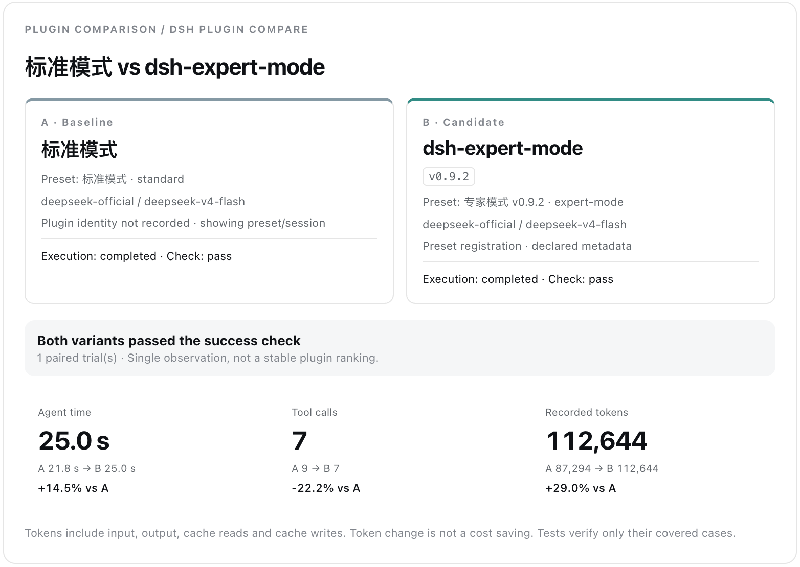

# DSH Plugin Compare

> Compare the runs. Inspect the evidence.

`dsh-plugin-compare` compares DeepSeek Harness plugins and presets using existing sessions or controlled A/B runs. It turns recorded execution evidence into side-by-side timelines, measurable deltas, explicit success checks, and shareable comparison reports.

[](./example/results/checkout-demo.html)

中文文档: [README.zh.md](./README.zh.md)

## Installation

Requires Node.js 22.19+ and a DSH Web profile. While the package is in prerelease, explicitly install the `next` channel:

```bash
dsh plugin --profile web add dsh-plugin-compare@next
dsh web
```

Stable releases use the unqualified package name:

```bash
dsh plugin --profile web add dsh-plugin-compare
```

npm requires every published package to have a `latest` tag. The first published version bootstrapped `latest` to an alpha, and later prereleases update only `next`; an unqualified install may therefore still resolve to an alpha. Treat it as a prerelease and use `@next` explicitly until the first stable release moves `latest` to a stable version.

Update or remove the installed package with the same profile:

```bash
dsh plugin --profile web update dsh-plugin-compare@next
dsh plugin --profile web remove dsh-plugin-compare
```

After installing, updating, or removing the plugin, stop any running Web Host with `Ctrl+C` and start `dsh web` again. The Compare panel is then available in DSH Web.

## Try the checkout example

Follow the [step-by-step walkthrough (Chinese)](./example/README.md): create a fresh intentionally broken checkout project, compare Standard and `dsh-expert-mode`, inspect the checks, and save screenshots and reports. A reviewed real-run [HTML report](./example/results/checkout-demo.html) and [screenshots](./example/screenshots/README.md) are included. The fixture needs no third-party dependencies; model-backed runs still consume tokens. Run `node example/prepare.mjs` from this repository to prepare a fresh workspace without changing the fixture.

## Status

Alpha. The Web `Compare` panel can compare two existing sessions or run a controlled baseline/candidate pair. Controlled runs explicitly select one configured provider/model for both variants, copy the source workspace twice, compose the selected agent preset in each copy, submit the same prompt, optionally execute the same success-check command, and capture runtime Git evidence. Reports include synchronized timelines, persisted file diffs, explicit check outcomes, and redacted JSON, self-contained HTML, SVG, or PNG exports. See [the roadmap](./docs/ROADMAP.md).

Historical sessions only expose `write` / `edit` diffs persisted in the canonical log. Runtime Git status and tracked diffs are available only for controlled runs, where they are captured before the temporary copies are removed.

The controlled runner supports 1–10 paired trials and alternates which variant runs first. It reports explicit-check counts plus mean and median paired deltas for time and tokens; a Student-t 95% interval is shown when at least two pairs exist. Raw paired observations and Session ids remain in JSON exports so the summary can be recomputed. These intervals describe observed variation under a small-sample assumption—they do not establish an automatic winner or a causal conclusion. Dependency directories are excluded from copies, external symlinks are refused, and Git worktree pointer files are not copied back into the experiment.

The selected provider/model is passed explicitly to every controlled Agent. If an Agent fails before completing its task, the structured failure is displayed and exported, the success-check command is marked `not-run`, and the comparison is labeled invalid rather than turning unchanged-code test failures into a preset result.

## Privacy before sharing

Exports can contain prompts, source paths, code diffs, command output, provider/model names, and Session ids. Automatic redaction is best-effort and is **not** a privacy clearance. Review every HTML, JSON, SVG, PNG, and screenshot before sharing it; remove credentials, account information, private URLs, personal paths, and proprietary source as appropriate. A redaction count of zero means only that no configured pattern matched.

## Evidence captured

- Task outcome and explicit test result
- Tokens, time, steps, retries, and tool failures
- Explicit test results and controlled-run Git snapshots
- Repeat trials and uncertainty display

## Development

Contributor requirements: Node.js 22.19+ and pnpm 11.19.

```bash
pnpm install
pnpm verify
```

Install a local checkout into DSH Web:

```bash
dsh plugin --profile web add link:/absolute/path/to/dsh-plugin-compare
dsh web
```

The repository targets DSH `0.1.1-rc.2` or newer compatible `0.1.x` builds. DeepSeek Harness is still in developer preview, so every release must be tested against the current published build.

CI tests both the minimum supported DSH version and the dynamic npm `latest` tag through a real plugin-install and Web-Host boot smoke test. See [Compatibility](./docs/COMPATIBILITY.md).

## Architecture

The package keeps deterministic comparison logic in `src/core`, DSH Host integration in `src/index.ts`, and the browser bundle in `src/client`. See [ARCHITECTURE.md](./docs/ARCHITECTURE.md).

## License

MIT
